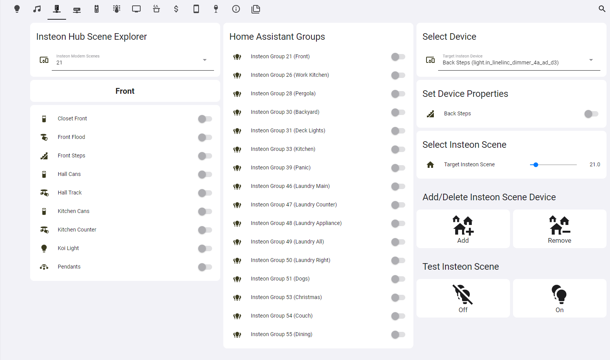

# Insteon Scene Explorer
This is a set of sensors, input_selects, automations and Lovelace screens for the Insteon Scene Explorer (ISE)



## Installation
This component takes advantage of [Home Assistant Packages](https://www.home-assistant.io/docs/configuration/packages/).  

### Ensure Home Assistant is configured to use packages
This component assumes that you are following the advice to create and configure the [packages folder](https://www.home-assistant.io/docs/configuration/packages/#create-a-packages-folder).  I've used the following at the beginning of my configuration.yaml, if you choose a different method, you'll need to adjust your steps accordingly.

```yaml
homeassistant:
  packages: !include_dir_merge_named packages/
```

### Copy/Create the code to your packages folder
Copy the [insteon-scene-explorer](./insteon-scene-explorer) folder to your home assistant packages folder location.

> NOTE: Each input and automation name is prefixed with "ISE - " in order to make it easy to identify these items in the interface.

### Copy/Create the Custom Scene name config file
Copy the [ise_named_groups.json](./ise_named_groups.json) file to your home assistant config folder location.  We'lll discuss how to use this later.

### Install dashboard prerequisites
To use this dashboard configuration, you'll need to custom components.  I highly suggest using the [Home Assistant Community Store](https://hacs.xyz/docs/configuration/basic) (HACS) to install the components. For installation instructions [see this guide](https://github.com/thomasloven/hass-config/wiki/Lovelace-Plugins).

1. Install `layout-card`
2. Install `button-card`

### Create/Update your dashboard
The Lovelace design makes use of several custom cards and you may need to adopt or change to suite your needs.
I created a new, empty [dashboard](https://www.home-assistant.io/dashboards/) to get started.  Add the contents of the [lovelace.yaml](./lovelace.yaml) to create the view seen above.

### Restart Home Assistant
Even if you've restarted Home Assistant prior to this step, this is a good time to make sure that you have a fresh restart to check your configuration.
Use the `Developer Tools` menu and **Check Configuration** on the `YAML` tab.  Assuming that you get the mesage "Configuration Valid!", click the **RESTART** link.

## Testing
After HA restarts, you should be able to navigate to your recently configured dashbaord and verify that you have a view similar to the above screenshot.  
If you do, great go to the next section!

If you do not, then you'll need to do some troubleshooting, starting with reviewing your logs.

TROUBLESHOOTING notes TBD

## Configuration
Now that you have your Insteon Scene Explorer working, you can customize it by supplying YOUR name for the numbered scenes.  For each numbered scene that you'd like to supply a name, add an entry to your `ise-named-groups.json` file that you placed in your config folder earlier.  For example,

```javascript
{
    "groups": { 
        "46": "Holiday Outside",
        "47": "Window Outlets"
    }
}
```
This file is read by the system every 30 seconds, so after a short wait, you should be able to refresh your dashboard to see your changes!
