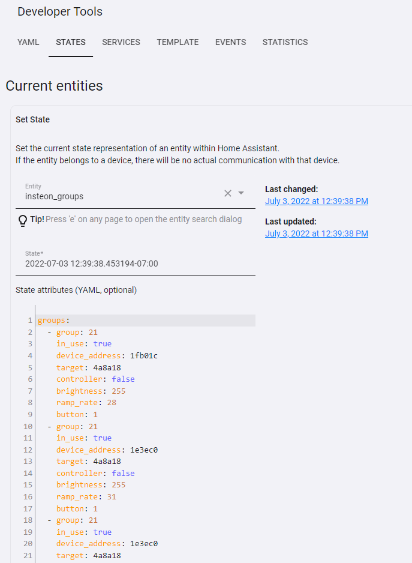

# Insteon Scene Explorer
This is a set of sensors, input_selects, automations and Lovelace screens for the Insteon Scene Explorer (ISE)

The YAML files have comments indicating what each component is doing.
One should start slowly, creating and testing each sensor.
The Lovelace design makes use of several custom cards and you may need to adopt or change to suite your needs.
Please note that I mostly use includes to include other yaml files, you may need to put some of these in your own or create them if you wish to use as is.

For the initial upload, I believe I captured everything.

First, implement at least **sensor.insteon_groups** from **sensor.yaml**.
This sensor should given something like this (of course it would have your own Insteon scenes):

If you examine this, it is kindof like a pivot of **insteon_devices.json** organized as a single entry for every device participating in a group. Like a group-based ALDB and not a entry-based one. This assumes  you have "jq" installed to parse JSON files (should be installed in most Home Assistant installations I think). It reads the JSON file that is kept around as the Insteon ALDB cache and reorganizes the information inside.

If you get this far and get entries in the sensor that are what you expect, continue on with the remainder.

Ultimately, when all put together, it looks like this in my installation:

